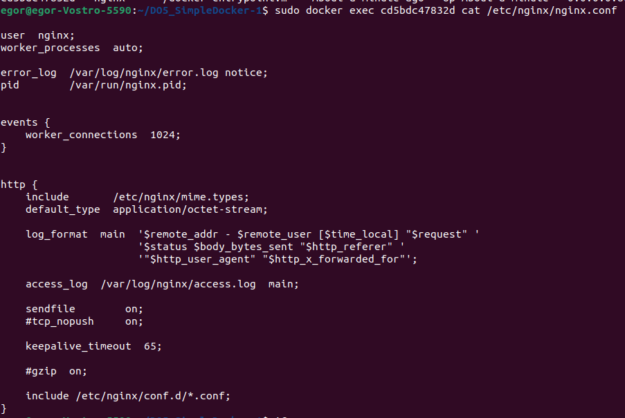
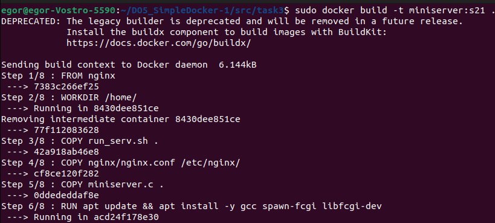
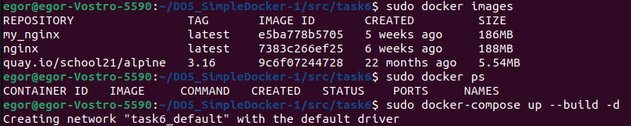

## Part 1. Готовый докер

1) Возьми официальный докер-образ с nginx и выкачай его при помощи docker pull.

  

2) Проверь наличие докер-образа через docker images.

  

3) Запусти докер-образ через docker run -d и проверь, что образ запустился через docker ps.

  

4) Посмотри информацию о контейнере через docker inspect [container_id|container_name].

  

5) По выводу команды определи и помести в отчёт размер контейнера, список замапленных портов и ip контейнера.

  

Значение параметра SizeRootFs указывает на размер корневой файловой системы контейнера в байтах. Значит размер контейнера можно оценить как около 187.6 МБ.

- Порты:

 

- ip контейнера 172.17.0.2:

6) Останови докер образ через docker stop [container_id|container_name] и проверь, что образ остановился через docker ps

7) Запусти докер с портами 80 и 443 в контейнере, замапленными на такие же порты на локальной машине, через команду run.

- -p 80:80 означает, что порт 80 хоста будет привязан к порту 80 контейнера.
- -p 443:443 означает, что порт 443 хоста будет привязан к порту 443 контейнера.

8) Проверь, что в браузере по адресу localhost:80 доступна стартовая страница nginx.

9) Перезапусти докер контейнер через docker restart [container_id|container_name] и проверь любым способом, что контейнер запустился.

- флаг -d указывает Docker на запуск контейнера в фоновом режиме

## Part 2. Операции с контейнером

1) Прочитай конфигурационный файл nginx.conf внутри докер контейнера через команду exec.

Команда docker exec используется для выполнения команд внутри запущенного контейнера Docker

2) Создай на локальной машине файл nginx.conf.

3) Настрой в нем по пути /status отдачу страницы статуса сервера nginx.

- я добавил серверный блок Nginx, в котором указал прослушивать порт 80 для входящих запросов.
- я добавил stub_status, который предоставляет информацию о текущей работе Nginx

4) Скопируй созданный файл nginx.conf внутрь докер-образа через команду docker cp и перезапусти nginx внутри докер-образа через команду exec.

- флаг -s reload указывает Nginx на перезагрузку своей конфигурации без остановки сервера

5) Проверь, что по адресу localhost:80/status отдается страничка со статусом сервера nginx.

6) Экспортируй контейнер в файл container.tar через команду export.

7) Останови контейнер.

8) Удали образ через docker rmi [image_id|repository], не удаляя перед этим контейнеры и удали остановленный контейнер.

9) Импортируй контейнер обратно через команду import.

10) Запусти импортированный контейнер.

- опция nginx -g 'daemon off;' запускает Nginx в контейнере и указывает ему не переходить в фоновый режим

11) Проверь, что по адресу localhost:80/status отдается страничка со статусом сервера nginx.

## Part 3. Мини веб-сервер
1. Напиши мини-сервер на C и FastCgi, который будет возвращать простейшую страничку с надписью Hello World!.

- FCGI_Accept() - это функция из библиотеки FastCGI, которая используется для принятия нового запроса от веб-сервера. Она возвращает значение больше или равное нулю в случае успешного принятия запроса, или отрицательное значение в случае ошибки или завершения работы.

2. Напиши свой nginx.conf, который будет проксировать все запросы с 81 порта на 127.0.0.1:8080.

- я добавил блок server 
- fastcgi_pass 127.0.0.1:8080;: Эта директива указывает Nginx перенаправлять запросы на FastCGI сервер, который запущен на localhost (127.0.0.1) и порту 8080. 

3) Заупстим контейнер с образом nginx в фоновом режиме

- -p 81:81 означает что при обращении к порту 81 на хосте будет обращение к порту 81 внутри контейнера.
- копируем в контейнер файл с конфигурацией nginx и сишный код сервера 

4) Запускаем интерактивную оболочку внутри контейнера

- устанавливаем там компилятор(gcc) и spawn-fcgi,libfcgi-dev (для FastCGI)

5) Компилируем сервер 

- запустим spawn-fcgi с скомпилированным исполняемым файлом на порту 8080.

## Part 4. Свой докер

1) Пишим свой докерфайл 

- в первой строке указываю что мой образ основан на официальном образе Nginx 
- далее устанавливаю рабочий каталог внутри контейнера на /home/
- копирую bash скрипт и сишный код в текущий каталог в контейнере 
- копирую файл конфигурации в контейнер 
- обновляю и устанавливаю нужные пакеты
- делаю скрипт исполняемым и запускаю его

2) Пишим скрипт который будет компилировать и запускать сервер 

-  service nginx start - эта команда запускает службу nginx, которая является веб-сервером
- /bin/bash эта команда запускает новый интерактивный оболочку bash

3) Создаем образ контейнера

- проверяем что образ создан 

4) Запускаем собранный докер-образ с маппингом 81 порта на 80 на локальной машине и маппингом папки ./nginx внутрь контейнера по адресу, где лежат конфигурационные файлы nginx'а 

-  -it для того чтобы контейнер был запущен в интерактивном режиме, и пользователь сможет взаимодействовать с ним через STDIN 

- -v $(pwd)/nginx/nginx.conf:/etc/nginx/nginx.conf - этот флаг монтирует файл конфигурации nginx.conf из текущего рабочего каталога на путь /etc/nginx/nginx.conf внутри контейнера. 

5) Проверяем, что по localhost:80 доступна страничка написанного мини сервера.

6) Допишим в ./nginx/nginx.conf проксирование странички /status, по которой надо отдавать статус сервера nginx.

- войдем в интерактивную оболочку контейнера

- установим vim (apt install vim) и отредактируем файл /etc/nginx/nginx.conf

- перезапустим контейнер 

- проверим что все работает 

## Part 5. Dockle

1) Просканируем образ из предыдущего задания через dockle

- первая ошибка указывает на то, что в образе Docker используется не безопасный способ хранения учетных данных в переменных окружения(NGINX_GPGKEY) для хранения ключа GPG.

- вторая ошибка указывает на то, что в Dockerfile после выполнения команды apt update && apt install -y gcc spawn-fcgi libfcgi-dev не было выполнено удаление кэша apt-get.

- варнинг указывает на то, что в вашем Dockerfile или контейнере используется пользователь root. 

2) Изменим Dockerfile 

- первую ошибку исправляем путем создания Docker на основе образа который мы написали ранее (my_nginx) в качестве базового образа 

- вторую ошибку мы исправили путем отчистки кэша rm -rf /var/lib/apt/lists после выполнения команд apt-get install|update

- предупреждение исправлем путем переключения контекста пользователя внутри контейнера на пользователя nginx.Так же мы изменили владельца и группу некоторых файлов и каталогов на nginx:nginx.

- что бы убрать CIS-DI-0006 указываем, что контейнер не имеет проверки состояния (healthcheck).

3) Проверяем что ошибки устранены

## Part 6. Базовый Docker Compose

1) Напишем файл docker-compose.yml

- server_task_5: севрис, который поднимает докер контейнер из прошлого задания.
- build: ../task5 указывает на то, что образ для этого сервиса будет собран из Dockerfile, из папки расположенной ../task5
- опция tty: true в файле конфигурации Docker Compose используется для создания терминала в контейнере
- второй сервис использует готовый образ nginx
- в нем мы подключаем порт 80 хоста к порту 8080 контейнера
- далле говорим что этот сервис зависит от сервиса "server_task_5"
- копируем файл с конфигурацией из локальной директории в контейнер 

2) Добавим в файл конфигурации nginx следующий код 

- серверу Nginx слушает порт 8080 для входящих запросов
- server_name localhost сервер будет обрабатывать запросы только для домена localhost
- proxy_pass http://server_task_5/  указывает Nginx на то, что все запросы, поступающие на данный виртуальный сервер, должны быть перенаправлены на другой сервер с адресом http://server_task_5/

3) Соберем и запустим проект 

- sudo docker-compose up --build -d. 
- up - это команда, которая используется для создания и запуска контейнеров
- --build - это флаг, который указывает на необходимость пересборки образов контейнеров перед их запуском
-  -d - это флаг на запуск контейнеров в фоновом режиме

- sudo docker-compose down --rmi all команда для остановки и удаления контейнеров
